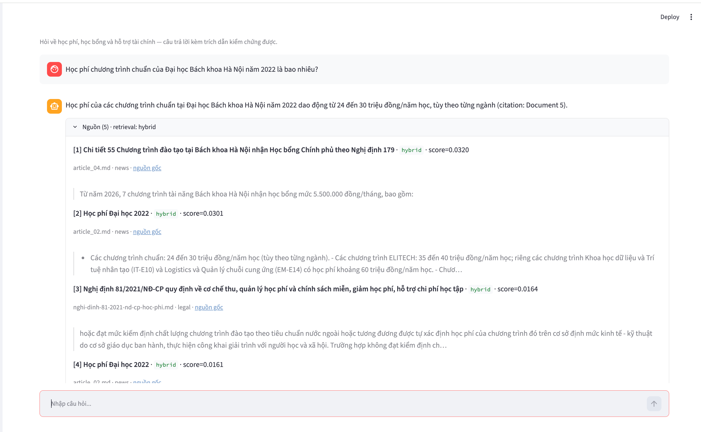
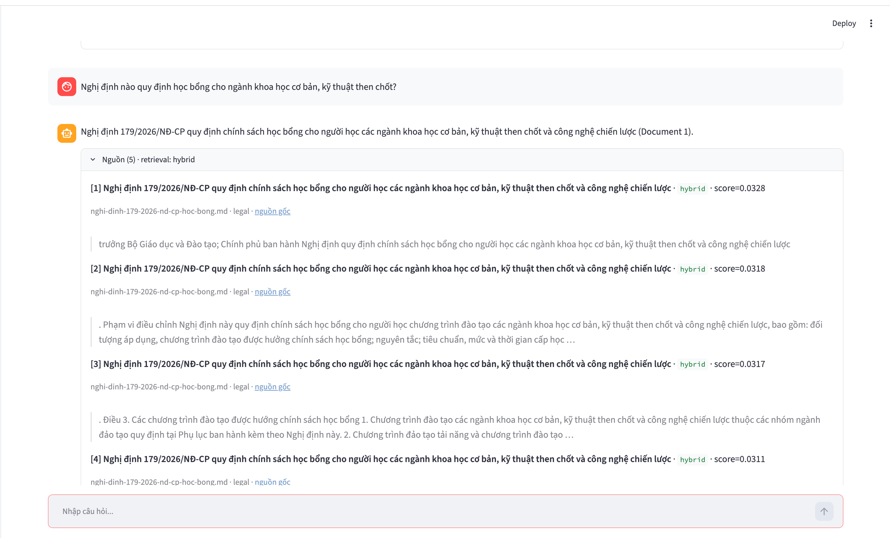

# Individual contribution report

## Thông tin

- Họ và tên: Lê Tuấn Anh
- Mã học viên: 2A202602952
- Nhóm: K4-L3A-RAG-T009
- Repository/branch: github.com/anhltsefpt/K4-L3A-RAG-T009 — `main`

## Phần việc đã thực hiện

| Module/deliverable | Việc tôi trực tiếp làm | File/commit/PR | Trạng thái |
|---|---|---|---|
| Generation có citation | `reorder_for_llm` (chống lost-in-the-middle, không mutate), `format_context` (nhãn title/source), `call_llm` (dispatch OpenAI/Gemini/Anthropic), `generate_with_citation` (safe refusal khi thiếu evidence/provider lỗi) | `src/task10_generation.py` — commit `a65f14b` | Done |
| Streamlit UI | Gọi `generate_with_citation(query, top_k)`, hiển thị answer + panel nguồn map về `SearchResult` (title/source/method/score), lưu `session_state` đủ để render lại nguồn | `app.py` — commit `a65f14b` | Done |
| Golden dataset | 15 case grounded từ corpus, 3 loại (từ khóa / ngữ nghĩa / dễ nhầm nguồn), `expected_context` trích thật | `group_project/evaluation/golden_dataset.json` — commit `019f385` | Done |
| Evaluation A/B | Script chạy Config A (dense) vs B (hybrid+RRF), 4 metric ragas; điền `RESULT.md` (delta, worst performers, root cause, recommendation) | `scripts/evaluate_rag.py`, `group_project/evaluation/RESULT.md` — commit `019f385` | Done |

## Quyết định kỹ thuật quan trọng

1. **Quyết định:** Safe refusal ở `generate_with_citation` — không có chunk → `sources=[]`, `retrieval_source="none"`; provider lỗi → bọc `try/except` quanh `call_llm` để UI không crash.  
   **Lý do/evidence:** `SYSTEM_PROMPT` yêu cầu từ chối khi thiếu bằng chứng; contract `validate_generation_result` yêu cầu 3 field đồng bộ. Test `test_generation_result_validator_accepts_safe_refusal` pass.  
   **Trade-off:** Khi provider lỗi tôi vẫn giữ `sources` đã truy xuất (thay vì rỗng) để UI còn hiển thị nguồn — đánh đổi giữa "refusal thuần" và tính hữu dụng.

2. **Quyết định:** Eval A/B chỉ đổi retrieval strategy (`use_reranking`), giữ cố định generator/prompt/top_k/evaluator; script dùng lại hàm public của `task10` thay vì gọi `generate_with_citation`.  
   **Lý do/evidence:** Cô lập biến để delta metric phản ánh đúng đóng góp RRF. Kết quả: Config B thắng cả 4 metric (avg 0.723 → 0.814, context_recall +0.20).  
   **Trade-off:** `generate_with_citation` cứng `use_reranking=True` nên script phải tự dựng generation dense-only → trùng lặp nhẹ, đổi lại giữ nguyên public signature (test `test_public_function_signatures_are_stable` pass).

## Kiểm thử và kết quả

- Test đã dùng: `pytest tests/test_contracts.py` (15 pass), `tests/test_acceptance.py` (5 pass) — tổng **20/20 pass**.
- Query in-domain (học phí) vs out-of-domain (phở bò): best dense cosine ≈ 0.62 vs 0.32 → dùng để hiệu chỉnh threshold (~0.45).
- Kết quả A/B: Config B (hybrid+RRF) > Config A (dense) ở cả 4 metric; recall +0.20, faithfulness +0.068.
- Lỗi phát hiện: (a) `reorder_for_llm` xáo thứ tự Document làm lệch citation → case #8 faithfulness=0; (b) số hiệu nghị định nằm ở header bị tách chunk → case #11 context_recall=0. Đã ghi root cause + recommendation vào `RESULT.md`.

**Ảnh demo (Streamlit UI):**

*(Ảnh demo out-of-domain / safe refusal: sẽ bổ sung.)*

## Điều còn hạn chế

- Citation dùng số "Document N" không ổn định sau `reorder_for_llm`, làm faithfulness một số case bị đánh giá thấp dù answer đúng (thấy rõ ở ảnh demo in-domain: answer cite "Document 5" trong khi con số nằm ở nguồn khác).
- Nếu có thêm thời gian: đánh nhãn citation theo `source/title` (hoặc gán số trước reorder), và prepend số hiệu nghị định vào mỗi chunk khi index để cải thiện context recall.

## Xác nhận đóng góp

Tôi xác nhận nội dung trên phản ánh đúng phần việc của mình và có thể giải thích hoặc chạy lại trong buổi demo.

- Ngày: 2026-09-20
- Tên thành viên: Lê Tuấn Anh
